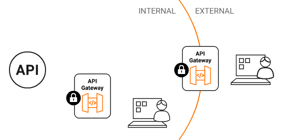
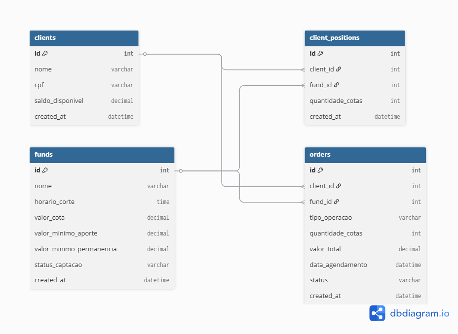
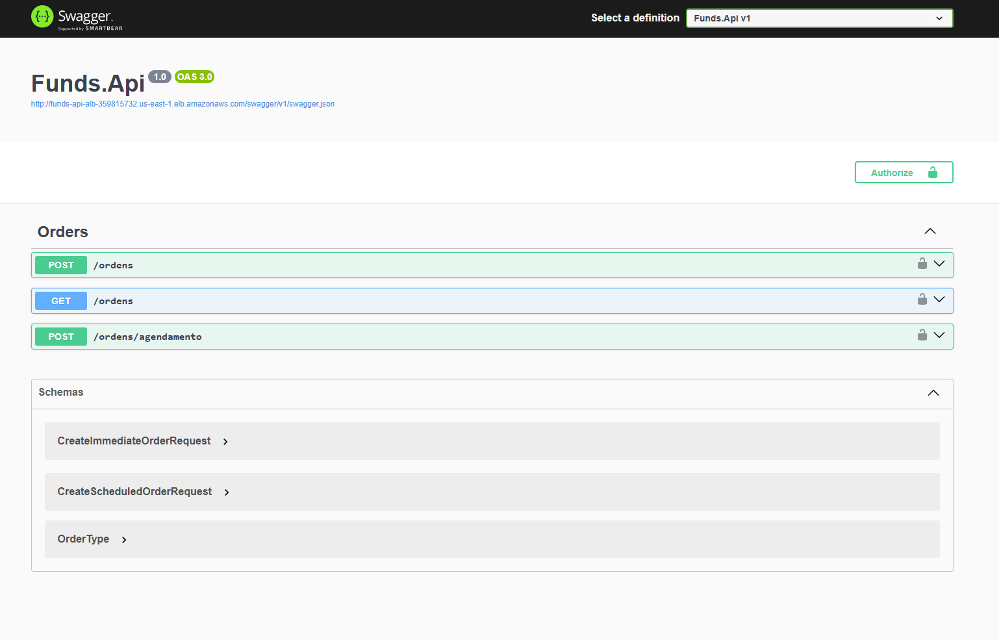
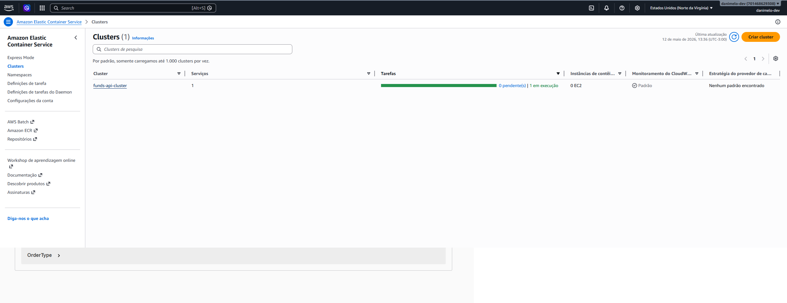
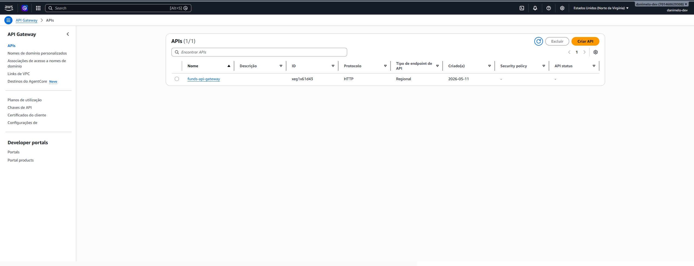
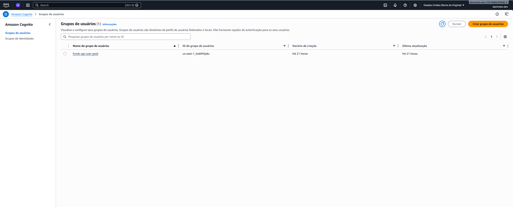
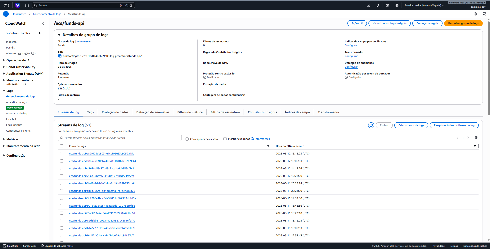
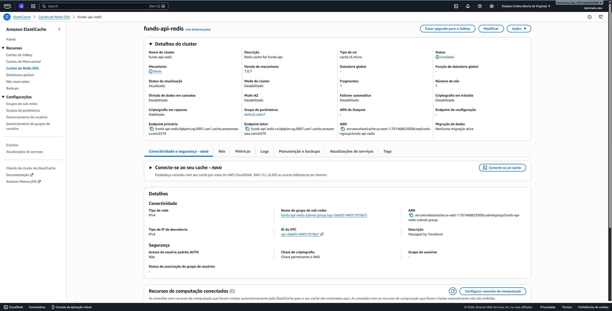

# Funds API — Case Técnico Itaú

> API para negociação de fundos de investimento, construída com .NET 8, Clean Architecture, AWS, Terraform, CI/CD, Cognito, API Gateway, ECS Fargate, RDS SQL Server, Redis, observabilidade e testes.

<p align="center">
  
</p>

---

# Visão Geral

Este projeto implementa uma API para operações de:

* Aporte
* Resgate
* Agendamento de ordens

em fundos de investimento.

A solução foi construída com foco em:

* Regras de negócio financeiras
* Arquitetura moderna
* Segurança enterprise
* Infraestrutura cloud-native
* Resiliência
* Observabilidade
* Escalabilidade

---

# Arquitetura

> Inserir aqui o desenho da arquitetura cloud.

<p align="center">
  
</p>

## Fluxo principal

```txt
Client
→ Amazon Cognito
→ API Gateway JWT Authorizer
→ Application Load Balancer
→ ECS Fargate (.NET 8 API)
→ RDS SQL Server
→ ElastiCache Redis
```

---

# Modelagem de Dados

> Inserir aqui o DER/MER do banco.

<p align="center">
  
</p>

## Principais entidades

* Clients
* Funds
* ClientPositions
* Orders

---

# Design System / API Experience

> Espaço reservado para Swagger, Insomnia, CloudWatch e AWS Console.

<p align="center">
  
</p>

---

# Tecnologias

## Backend

* .NET 8
* ASP.NET Core Web API
* Entity Framework Core
* SQL Server
* Clean Architecture
* Dependency Injection
* xUnit
* FluentAssertions

## Cloud & Infra

* AWS ECS Fargate
* Amazon ECR
* Amazon RDS SQL Server
* Amazon ElastiCache Redis
* Amazon Cognito
* Amazon API Gateway
* AWS Secrets Manager
* Amazon CloudWatch
* Terraform

## DevOps

* Docker
* GitHub Actions
* CI/CD
* Deploy automatizado no ECS

---

# Endpoints

| Método | Endpoint              | Descrição                       | Auth    |
| ------ | --------------------- | ------------------------------- | ------- |
| POST   | `/ordens`             | Aplicações e resgates imediatos | JWT     |
| POST   | `/ordens/agendamento` | Agendamento de ordens           | JWT     |
| GET    | `/ordens`             | Consulta ordens                 | JWT     |
| GET    | `/health/live`        | Liveness                        | Público |
| GET    | `/health/ready`       | Readiness                       | Interno |

---

# Autenticação

A autenticação é feita com Amazon Cognito.

## Fluxo

```txt
Usuário autentica no Cognito
→ Cognito emite JWT
→ Client envia Bearer Token
→ API Gateway valida JWT
→ API valida JWT Cognito
→ Requisição chega ao ECS
```

## Exemplo

```http
GET /ordens
Authorization: Bearer {access_token}
```

---

# Payloads

## Aporte imediato

```json
{
  "idCliente": 1,
  "idFundo": 1,
  "tipoOperacao": "Aporte",
  "quantidadeCotas": 10
}
```

## Resgate imediato

```json
{
  "idCliente": 1,
  "idFundo": 1,
  "tipoOperacao": "Resgate",
  "quantidadeCotas": 5
}
```

## Agendamento

```json
{
  "idCliente": 1,
  "idFundo": 1,
  "tipoOperacao": "Aporte",
  "quantidadeCotas": 10,
  "dataAgendamento": "2026-12-01"
}
```

---

# Regras de Negócio

## Aporte imediato

* Validação de saldo disponível
* Validação de valor mínimo de aporte
* Validação de capacity do fundo
* Validação de horário de corte

## Resgate imediato

* Validação de quantidade de cotas
* Validação de saldo mínimo de permanência
* Atualização de posição do cliente
* Atualização de saldo

## Agendamento

* Apenas datas futuras
* Recusa fins de semana
* Resgate valida posição atual
* Aporte não valida saldo atual
* Capacity validado

---

# Observabilidade

A aplicação possui logs estruturados com:

* Serilog
* CorrelationId
* Logs HTTP
* Logs de cache
* Logs de negócio
* CloudWatch Logs

## Exemplo

```txt
[INF] [CorrelationId: abc-123]
HTTP GET /ordens responded 200 in 35ms

[INF] [CorrelationId: abc-123]
Cache hit. Key: orders:all
```

---

# Cache Distribuído

O projeto utiliza Redis via Amazon ElastiCache.

## Estratégia

```txt
GET /ordens
→ tenta Redis
→ cache hit: retorna cache
→ cache miss: consulta SQL Server
→ salva cache
```

## Invalidação

```txt
POST /ordens
POST /ordens/agendamento
→ remove cache de ordens
```

## Resiliência

Se Redis falhar:

```txt
API continua funcionando usando SQL Server
```

---

# Resiliência

A solução implementa:

* Retry controlado
* Fallback de cache
* Health checks
* ECS grace period
* Logs estruturados
* CorrelationId
* Tratamento global de exceções

---

# Segurança

* JWT via Cognito
* API Gateway JWT Authorizer
* Secrets no AWS Secrets Manager
* Banco privado
* Redis privado
* Security Groups segregados
* Swagger protegido com Bearer token
* Sem secrets no código

---

# CI/CD

O projeto possui pipelines separados:

## CI

```txt
restore
→ build
→ tests
```

## CD

```txt
docker build
→ push ECR
→ deploy ECS
```

## Fluxo

```txt
git push
→ GitHub Actions
→ Amazon ECR
→ ECS Fargate
→ nova task
```

---

# Como Rodar Localmente

## Pré-requisitos

* .NET 8 SDK
* Docker
* SQL Server
* Redis

## Subir dependências

```bash
docker compose up -d
```

## Rodar API

```bash
dotnet restore
dotnet build
dotnet run --project ./Funds.Api
```

## Swagger

```txt
https://localhost:{porta}/swagger
```

---

# Testes

## Rodar testes

```bash
dotnet test ./Funds.Api.Tests/Funds.Api.Tests.csproj -v normal
```

## Cenários cobertos

* Aporte válido
* Saldo insuficiente
* Fundo fechado
* Horário de corte
* Resgate inválido
* Permanência mínima
* Agendamento inválido
* Fim de semana
* Resgate sem cotas
* Agendamento válido

---

# Terraform

## Inicializar

```bash
cd infra/terraform
terraform init
```

## Planejar

```bash
terraform plan
```

## Aplicar

```bash
terraform apply
```

## Destroy

```bash
terraform destroy
```

---

# Evidências

## ECS

<p align="center">
  
</p>

## API Gateway

<p align="center">
  
</p>

## Cognito

<p align="center">
  
</p>

## CloudWatch

<p align="center">
  
</p>

## Redis Cache

<p align="center">
  
</p>

---

# Uso de IA

A IA foi utilizada como apoio técnico para:

* Refinamento da arquitetura
* Revisão de segurança
* Estruturação Terraform
* Debugging AWS/ECS
* Observabilidade
* Documentação técnica
* Revisão de código

As decisões finais de arquitetura e implementação foram validadas manualmente.

---

# Decisões Técnicas

## Por que Cognito?

Separação de autenticação/autorização da aplicação.

## Por que API Gateway?

Camada segura antes do ECS.

## Por que Redis?

Redução de latência e carga no banco.

## Por que RDS privado?

Segurança e isolamento.

## Por que Terraform?

Infraestrutura reproduzível e versionada.

## Por que ECS Fargate?

Menor overhead operacional comparado a Kubernetes para o escopo do case.

---

# Status Final

```txt
✅ API .NET 8
✅ Clean Architecture
✅ Regras de negócio
✅ Testes unitários
✅ Docker
✅ Terraform
✅ ECS Fargate
✅ SQL Server
✅ Redis
✅ Cognito
✅ API Gateway
✅ JWT Authorizer
✅ CloudWatch
✅ Serilog
✅ CorrelationId
✅ Swagger JWT
✅ CI/CD
✅ Secrets Manager
```

---

# Autor

Desenvolvido por Daniel Melo.

> Case técnico focado em backend, cloud architecture, observabilidade, segurança e engenharia de software moderna.
